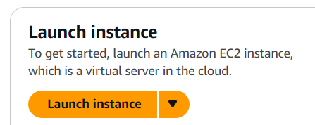
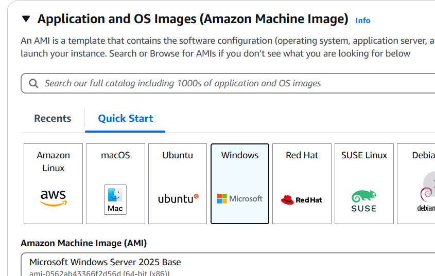
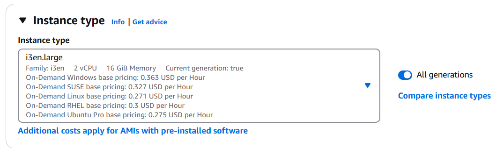
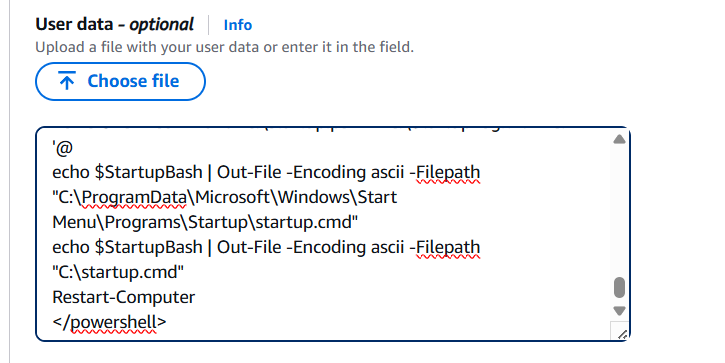

# ready-room-selfhosted

[ready-room.net](https://ready-room.net/) was a service to host DCS World servers on demand on AWS that closed down on 1/2/2025. ready-room-selfhosted takes the original code and lessons learnt to deliver a script that can be used for self hosting on AWS.

[Discord](https://discord.gg/hURRqGP)

## Hosting principle

The main idea of ready-room.net and ready-room-selfhosted is to optimise cost for relativley infrequent hosting - i.e. squadron sessions for a few hours a couple of times a week / not 24x7. The biggest expense for relatively infrequent hosting is persistent storage (disks) becuase its a 24x7 expense even if the EC2 instance has been stopped. Optimising cost in this case means avoiding persistent storage. ready-room.net did it by caching files in s3, ready-room-selfhosted does it by installing from scratch each time. Installing from scratch each time will take longer than using cached s3 files, but since DCS introduced the modular installer for DCS World server it should be managable since only the required map module will need to be downloaded (as opposed to all of them). An added benefit of scratch installing every time is that the server can be installed onto the physically co-located SSD storage for best performance. As of 15/4/25 it's about 30min to install DCS Server with the Caucasus terrain module and start a mission on an AWS EC2 i3en.large instance.

## How To

Powershell script to be supplied as AWS EC2 User data that will install and start DCS Server.

```
<powershell>
### Parameters ###
$terrain = "Caucasus terrain"
$WindowsAdminPassword = "dcsadmin"
$missionUrl = "https://ready-room-public.s3.ap-southeast-2.amazonaws.com/tacview_test.miz"
$missionName = "tacview_test.miz"

# Simultaneous logins on a single account are limited
# so please create and use your own server account
$serverUsername = "readyroom1"
$serverPassword = "kaUEE9k0td4I2nev"

# Consider keeping exports disabled to minimise bandwidth
$allow_object_export = "false"
$allow_sensor_export = "false"
$name = "Test Server"
$password = "mypassword"
$allow_trial_only_clients = "true"
$maxPlayers = "64"

### End Parameters ###

# Save config
$config=@"
`$terrain="$terrain"
`$WindowsAdminPassword="$WindowsAdminPassword"
`$missionUrl = "$missionUrl"
`$missionName = "$missionName"
`$serverUsername = "$serverUsername"
`$serverPassword = "$serverPassword"
`$allow_object_export = "$allow_object_export"
`$allow_sensor_export = "$allow_sensor_export"
`$name = "$name"
`$password = "$password"
`$allow_trial_only_clients = "$allow_trial_only_clients"
`$maxPlayers = "$maxPlayers"
"@
 echo $config | Out-File -Encoding ascii -Filepath "C:\config.ps1"

# Disable windows password complexity
secedit /export /cfg c:\secpol.cfg
(gc C:\secpol.cfg).replace("PasswordComplexity = 1", "PasswordComplexity = 0") | Out-File C:\secpol.cfg
secedit /configure /db c:\windows\security\local.sdb /cfg c:\secpol.cfg /areas SECURITYPOLICY

# Set windows password
net user Administrator $WindowsAdminPassword

# Configure auto-login on startup and run the install script as an on statup (login) script
# This creates a desktop environment for the DCS GUI installer to run in
# https://learn.microsoft.com/en-au/troubleshoot/windows-server/user-profiles-and-logon/turn-on-automatic-logon

$newItemPropertySplat = @{
    Path = 'HKLM:\SOFTWARE\Microsoft\Windows NT\CurrentVersion\Winlogon'
    Name = 'AutoAdminLogon'
    PropertyType = 'String'
    Value = '1'
}
New-ItemProperty @newItemPropertySplat

$newItemPropertySplat = @{
    Path = 'HKLM:\SOFTWARE\Microsoft\Windows NT\CurrentVersion\Winlogon'
    Name = 'DefaultUserName'
    PropertyType = 'String'
    Value = 'Administrator'
}
New-ItemProperty @newItemPropertySplat

$newItemPropertySplat = @{
    Path = 'HKLM:\SOFTWARE\Microsoft\Windows NT\CurrentVersion\Winlogon'
    Name = 'DefaultPassword'
    PropertyType = 'String'
    Value = $WindowsAdminPassword
}
New-ItemProperty @newItemPropertySplat

# Install script that runs after auto login
# Note AWS User data is capped at 16KB when encoded, so the primary startup script
# is downloaded externally to work around this limit
$webClient = [System.Net.WebClient]::new()
$webClient.DownloadFile("https://raw.githubusercontent.com/jimvella/ready-room-selfhosted/refs/heads/main/startup.ps1", "C:\startup.ps1")

# Add batch file to trigger script on login and reboot
$StartupBash=@'
PowerShell -Command "Set-ExecutionPolicy -Force Unrestricted >> C:\StartupLog.txt 2>&1"
PowerShell -Command "C:\startup.ps1 >> C:\StartupLog.txt 2>&1"
'@
echo $StartupBash | Out-File -Encoding ascii -Filepath "C:\ProgramData\Microsoft\Windows\Start Menu\Programs\Startup\startup.cmd"
echo $StartupBash | Out-File -Encoding ascii -Filepath "C:\startup.cmd"
Restart-Computer
</powershell>

```

## How To - Expanded

### Prerequisites

The .miz mission file needs to be availble for download by a script - a public s3 bucket is ideal.
Review the parameters section of the powershell script above and update as required.

### AWS EC2 Step by step

1. AWS console EC2 service, click 'Launch instance'.
   

2. Select 'Windows' from the Quick start AMIs.
   

3. Select an instance type. The instance needs to have an SSD volume large enough to accomodate the DCS Server installation. [i3en.large](https://aws.amazon.com/ec2/instance-types/i3en/) is probably the least expensive instance with a large enough volume. [z1d.xlarge](https://aws.amazon.com/ec2/instance-types/z1d/) is probably the best value option for high performance compute. See https://aws.amazon.com/ec2/pricing/on-demand/
   

4. Select a key pair login. This isn't actually required since the windows admin password will be set by the user data script, but if it's not set the EC2 wizard will prompt you again to confirm a key pair is not required.

5. Configure Network settings. This is most conveniently done by having an existing security group already configured to select. The security group needs to be configured to allow inbound access on the DCS server ports (10308 TCP and UDP), as well as any other services required - e.g. rdp / remote desktop (3389 TCP).

6. (Optional) Configure Purchasing option 'Spot instances'. This in the expanded 'Advanced details' section. A [spot instance](https://aws.amazon.com/ec2/spot/) is potentially cheaper at the risk of being terminated early.

7. Configure the User data script. This in the expanded 'Advanced details' section. Copy and pase the script in the above section with any parameter changes including the enclosing `<powershell>` tags into the user data text area.
   

8. Launch instance

9. Remember to Terminate the instance when it's no longer required to avoid unecessary expense.

## Notes and future work

- The install script could be extended to include extra services such as SRS, Tacview, Olympus, Mods, etc.

- The gui automation aspect of the script could be made more resilient.

- Operating system performance optimisatons, e.g. configuring windows temporary storage to use SSD storage over network storage might improve the performance of DCS Server.
